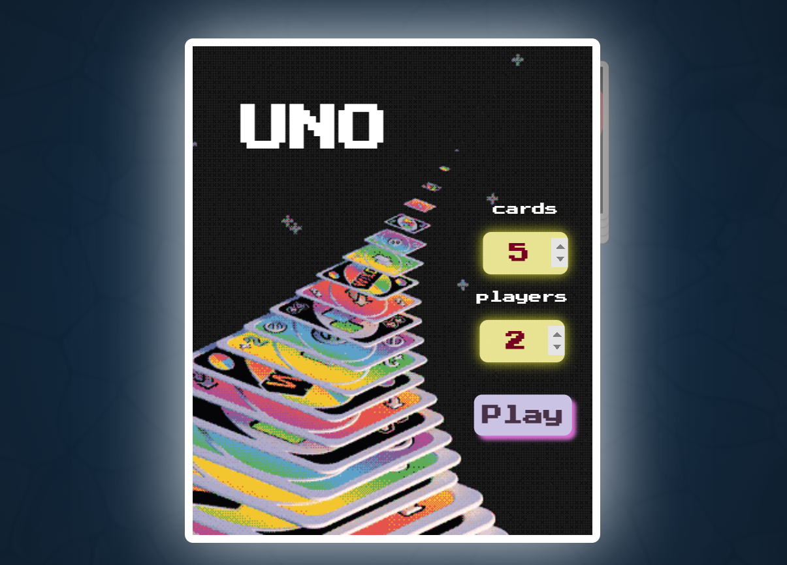
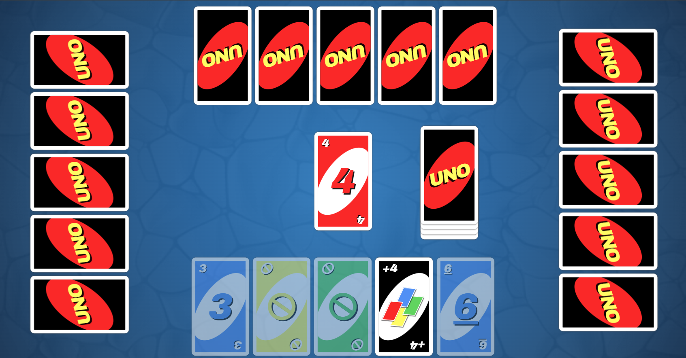

# UNO Game 🎴

A web-based card game inspired by UNO, built from scratch using **HTML, CSS, and JavaScript**.  
The project focuses on creating an interactive game experience with card movement, player turns, animations, and game logic.

## 🎮 Demo

[GitHub Pages link](https://hawramohammed.github.io/UnoGame/)

## 📸 Screenshots

## ✨ Features

- 🃏 Interactive card gameplay
- 🎨 Custom-designed game interface
- 🔄 Dynamic card movement and animations
- 👥 Multiple players support
- 🤖 Automated player logic
- 🏆 Win and game-over states
- 🔊 Sound effects and background music
- 📱 Responsive layout

## 🛠️ Technologies Used

- **HTML** — Structure of the game
- **CSS** — Styling, animations, gradients, and visual effects
- **JavaScript (ES6)** — Game logic, DOM manipulation, and interactions

## 📚 Attributions

The following resources were used during development:

- **Fonts**
  - Archivo font by Google Fonts  
    https://fonts.google.com/specimen/Archivo
  - Press Start 2P font by Google Fonts  
    https://fonts.google.com/specimen/Press+Start+2P

- **Icons**
  - Font Awesome icons  
    https://fontawesome.com/

    ## 🛠️ 🚀 Future Development 

- Add a timer to restrict the response time for the human player
- Make accessible through mobile phones and other devices

